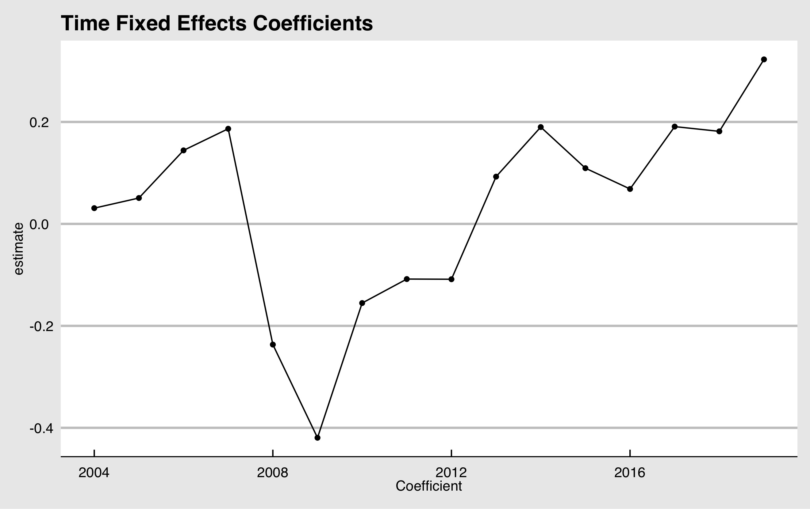
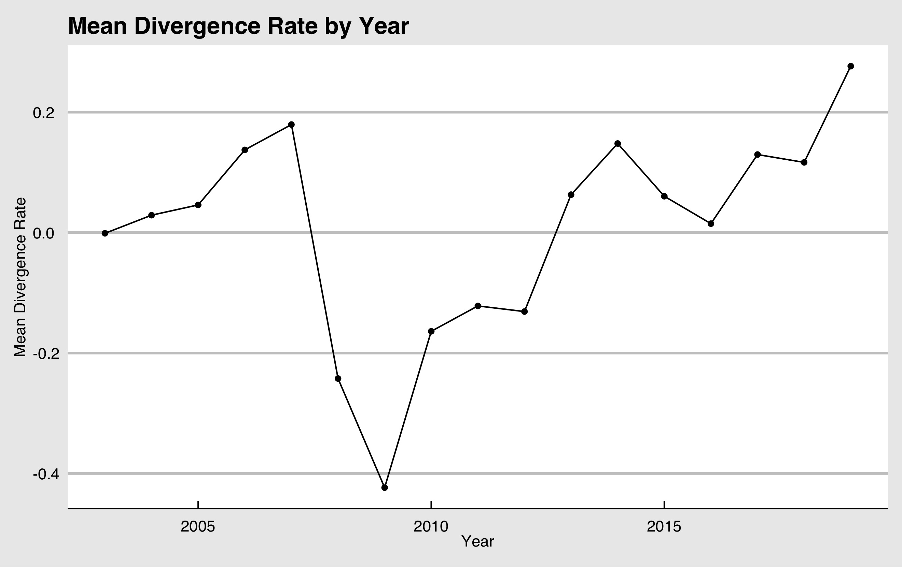
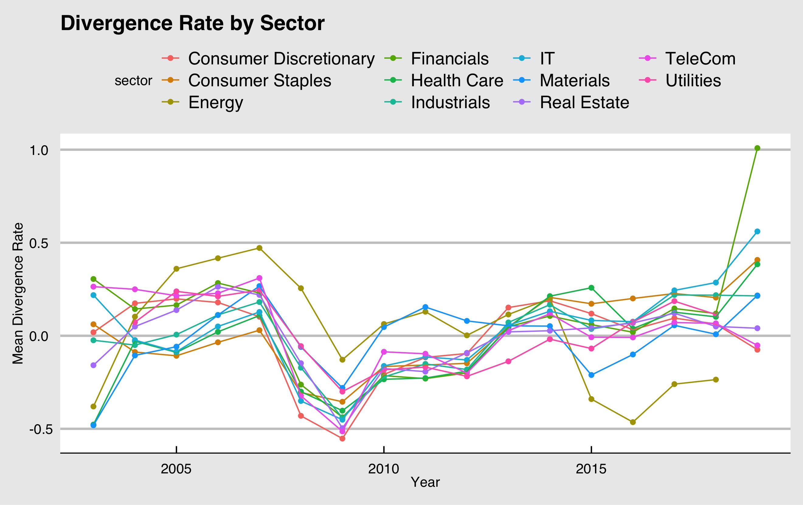
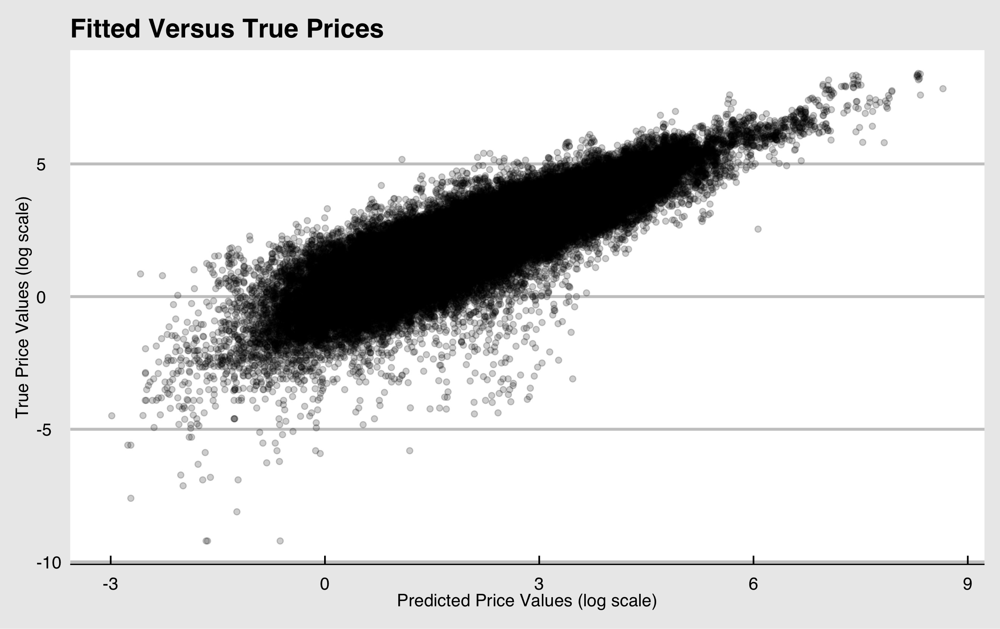

NOTES: THIS FIGURE WIDTH CODE ISN'T WORKING TO REDUCE THE IMAGE SIZE AND THE BIBLIOGRAPHY CODE POPULATES QUESTION MARKS INSTEAD OF CITATIONS IN THE BRACKETS. NEED TO REPLACE ALL \cite{kaizoji} with [@kaizoji]. I TESTED THIS METHOD AND IT WORKS. FOR THE IMAGES, I THINK WE NEED TO USE KNITR TO SIZE THE IMAGES OR MANUALLY LOAD EACH IMAGE AND SAVE AS A SMALLER SIZE. CODE EXAMPLE BELOW:

```{r, out.width = "400px"}
#knitr::include_graphics("path/to/image.png")
```

# Abstract
Recreate the paper, describe. Extend analysis through current year. Summarize findings. 

The purpose of this project is to see what the differences between company fundamentals and share prices can tell us about economic recessions. We replacated the results from "Stock Market Market Crash of 2008: an empirical study of the deviation of share prices from company fundamentals" by Taisei Kaizoji and Michiko Miyano \cite{kaizoji}. We used the fundamental indicators of `cash and short-term investments`, `dividends per share`, and `carrying value` to fit out model and fit the individual fixed effects model. Then, we found the divergence rate from the actual share price. By looking at the divergence rates, we were able to see that there was a positive deviation between the company fundamentals and share prices right before a recession (i.e. overvalued during the years leading up to the recession in 2008) and a negative deviation during the recession (i.e. undervalued in 2008). Finally, we look at specific markets and market anomalies. 

# Data
Our data source is ____. Description of variables. Give relevant definitions, context, etc.
JENN IF YOU THINK WE ANSWERED ALL OF THESE PLEASE DELETE THE ABOVE. A: WE STILL NEED TO ADD INFO ON THE HANDLING OF TIME

Our data is sourced from Factset. \cite{data} The quarterly fundamental indicators (i.e. `cash and short-term investments`, `dividends per share`, and `carrying values`) and `share price` from U.S companies between 2003 to 2019 were used. Time was treated as a discrete variable where `share price` was the stocks' closing prices of the final day in the quarter. It is important to note that 2019 contains data for only the first quarter, which may lead to exaggerated trends for 2019. Additionally, we added a new binary variable to our data set based on `dividends per share` which was a decision we made during our initial data exploration. We noticed that many companies' quarterly data had dividends of 0. Therefore, `dividends = 0` simply indicated whether that instance of company fundamental data had a dividend of 0 or not. This is not a variable in the paper [@kaizoji], and is specific to our project. Each row consisted of one company's quarterly data during the year, and rows with any of the fundamental indicators or share price missing were omitted. This ultimately changed our total instances from 254,764 to 161,544. Our final data set included 5,727 companies from 11 sectors (i.e. industrials, financials, IT, Utilities, Consumer Discretionary, Health Care, Energy, Materials, Real Estate, Consumer Staples and Telecommunications). 184 companies did not have a sector associated in the data.

The fundamental indicators give valuable information about stocks. `Cash and short-term investments` show the amount of liquid assets a company has. Liquid assets are important to consider because it shows how much the company has that can be quickly converted to cash in the event of something happening. `Dividends per share` is the amount in dividends that a firm pays out to shareholders. \cite{dividend} Finally, the `carrying value`, which is also known as the book value, shows the stock's market value and how much shareholders would receive in the event that the company was liquidated. It is found by subtracting the company's total liabilities from total its assets, and can be a good indicator for investors when making decisions; it gives a sense of whether a stock is being overvalued or undervalued. For example, comparing the price at which the stock is trading at and its `carrying value` may play a role in investors' decisions to buy or sell the stock. \cite{bookvalue} "These three indicators are commonly used by financial professionals and investors in fundamental analysis as a tool for identifying the divergence of share price in the market from the intrinsic value of a company." \cite{kaizoji}

NOTE ON DATA: NEED TO ADDRESS THE HANDLING OF TIME. WE USED IT AS A DISCRETE VARIABLE. COLLAPSED OVER FOUR QUARTERS INTO SINGLE POINT FOR EACH YEAR. ALSO NEED TO MENTION THAT 2019 ONLY CONTAINS 1 QUARTER AT THE TIME OF THE STUDY.

# Models and Methodology
Our study focuses on the exploration of a number of linear regression models to predict stock price from company fundamentals. We started with the base model:

$$ln(price_{it}) = \beta_0 + \beta_1ln(dividends_{it}) + \beta_2\mathbb{I}(dividends = 0) + \beta_3ln(bookvalue_{it}) + \beta_4ln(cashflow_{it}) + \mu_{i} + \gamma_t + \epsilon_{it}$$
In this model, $\mu_i$ indicates the company effects and $\tau_t$ indicates the discrete time effects. Then, we fit the models described in table one.  

\begin{table}[!h]
\caption{$\mu$ and $\tau$ for All Tested Models}
\centering
\begin{tabular}{|l|l|l|}
\hline
 Model &  $\mu$ &  $\tau$ \\\hline
 Pooled \hspace{1mm} OLS &  0 & 0 \\
 Individual \hspace{1mm} Fixed \hspace{1mm} Effects & Fixed \hspace{1mm} Effect & 0 \\
 Time \hspace{1mm} Effects & 0 & Fixed \hspace{1mm} Effect  \\
 Two-Way \hspace{1mm} Fixed & 0 & Fixed \hspace{1mm} Effect \\
 Individual \hspace{1mm} Random & Random & 0 \\
 Time \hspace{1mm} Random & 0 & Random \\
 Two-Way \hspace{1mm} Random & Random & Random \\\hline
\end{tabular}
\end{table}  

We used F-tests to assess the pooled ols and fixed effects model performance, likelihood ratio tests to compare the pooled ols and fixed effects models, and Hausman Tests to compare the fixed and random effects models. In all cases, we obtained p-values indicating that the fixed effects models out-performed the pooled ols model and the random effects model. The best model overall was the fixed effect model with time and company intercepts included. These results replicate the results obtained in our source paper, even though our models were built with many more years of data. \cite{kaizoji}

# Divergence Rate  

## Definition  

The overarching research question of the paper we replicate here is not about building the best model given the data (although that step is important). Instead, the research question is about using a model that accurately describes stock prices to notice anomalies in the stock market. For this reason, the authors of the paper chose to use the fixed effects model with only company effects. \cite{kaizoji} This works because we can assume that, in a perfect market, company fundamentals will always compose the stock price in an additive way with no time effects. Then, we can use the predictions from our model to notice when stocks are over or undervalued in the market. Our source paper proposes a metric for this purpose named divergence rate defined as follows:

$$D_{it} = ln(Y_{it}) - ln(\tilde{Y}_{it})$$  

In this formula, $Y_{it}$ is the observed stock price for company $i$ at time $t$ and $\tilde{Y}_{it}$ is the model's prediction for the stock price of company $i$ at time $t$. The divergence rate indicates how over or undervalued a company's stock is given that company's fundamental value.   

## Mean Divergence Rate Over Time

The two figures below display the time effects coefficients from model and the mean divergence rate by year. We can see that, as expected, these two figures track each other. While it feels counterintuitive to leave an informative variable out of the model, in this case doing so gives us a powerful tool. Now, we can track in real time, how over or undervalued the market is as a whole. Our sample only contains one recession (2008-2009), so it is less powerful than a dataset that contains all known recessions. However, we can look here to seek potential recession indicating trends. In the years leading up to the recession, the market became overvalued. And then, in 2008, the recession led to an undervaluing of the market as a whole. Looking to the current year, we can see that 2019 the market appears more overvalued than at any other point in the dataset. Other recession indictors outside our model have also appeared recently, including the inversion of the bond yield curve, which has preceded every recent recession. \cite{yield} We interpret the overvaluing of 2019 by our indicated by our model cautiously, since we only have one quarter of 2019 in the data so far. But, this trend matches our assertion about the overvaluing of the market serving as a potential recession indicator. 





## Divergence Rate by Sector  





# Limitations & Future Work

The data we used is not the same as the one used in the paper, which had 7,796 international companies between the years 2004 to 2013 from the OSIRIS database. \cite{kaizoji} Our data was filtered for companies that showed share price in USD, and was filtered out for rows that were not missing in any of the fundamental indicators and response variable. However, as shown earlier, the results we had were similar to that of the paper and the graphs were reproducible as well. Our model performance was also high.

INCLUDE LIMITATION

In the future, we can change several aspecs of our project to look for other interesting trends. Firstly, our model only contains data from U.S. companies, since comparisions across currencies would have made the work of building this model more difficult. Normalizing across global currencies and including companies from markets outside the United States would likely improve the ability of this model to forecast recessions. Second, due to computational limitations, we did not include the entire history of the United States stock market. However, since the sample size of recessions is so small, including as many of them as possible in the model is important before drawing overarching conclusions about the validity of this model as a recession indicator. As of this work, the model only demonstrates that a high divergence rate may be related to an oncoming recession. Adding more recession samples might allow us to say that a high divergence rate is a likely recession indicator. 

# Conclusion


# Plots


Reproduce the plots in the paper. Note differences and extend to new years. Explore new plots, see if we can come up with anything more descriptive. 

 

# Sources

NEED TO ADD FULL CITATIONS HERE. BIBTEX OFFERS A WAY TO IMPORT THESE CITATIONS

# Appendix  

This project has an extensive codebase, which may be accessed on github. (https://github.com/elegant-chaos/recession_indicators) Please note: the database we sourced our data from has usage restrictions, so the repository does not include our dataset. 


