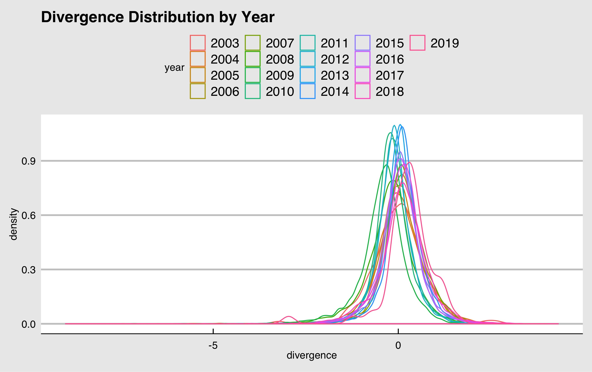
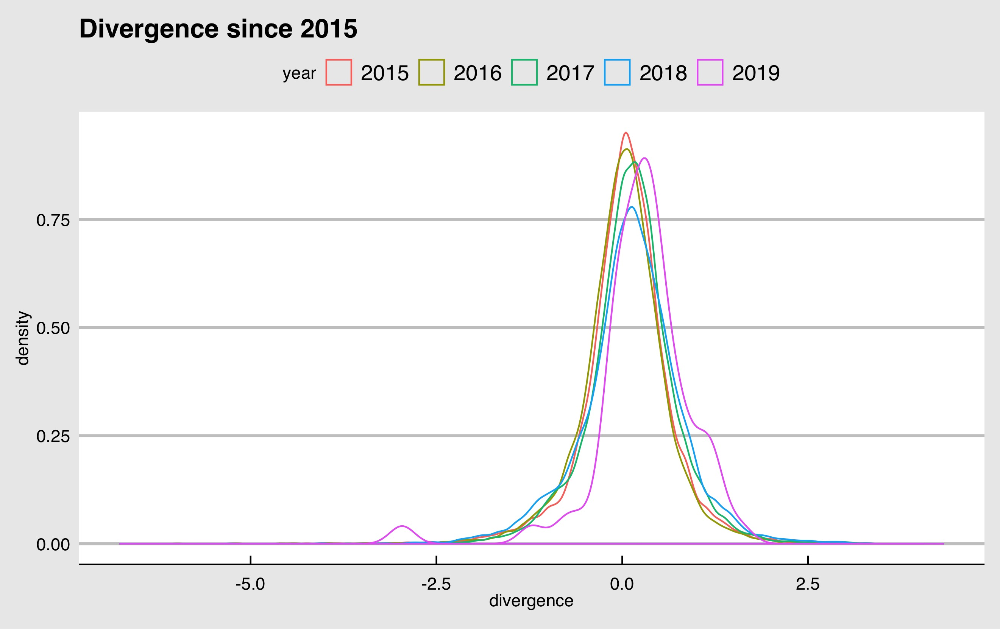

NOTE TO ERINA: ALL CAPS ISN'T YELLING AT YOU. THAT'S HOW I MAKE NOTES TO MYSELF IN THESE DOCS SO THAT I SEE THEM. THEY ARE NOTES YOU CAN ADDRESS OR I CAN ADDRESS. SORRY BECAUSE THEY DO SOUND LIKE YELLING WHEN YOU READ THEM LOL

NOTE TO JENN: SOUNDS GOOD! WILL DO THE SAME. ALSO, I ADD "abc" WHEREVER THINGS NEED TO BE FILLED IN/WORKED ON LATER ON JUST FYI

# Abstract
Recreate the paper, describe. Extend analysis through current year. Summarize findings. 

The purpose of this project is to see what the differences between company fundamentals and share prices can tell us about economic recessions. We replacated the results from "Stock Market Market Crash of 2008: an empirical study of the deviation of share prices from company fundamentals" by Taisei Kaizoji and Michiko Miyano. We used the fundamental indicators of `cash and short-term investments`, `dividends per share`, and `carrying value` to fit out model and fit the individual fixed effects model. Then, we found the divergence rate from the actual share price. By looking at the divergence rates, we were able to see that there was a positive deviation between the company fundamentals and share prices right before a recession (i.e. overvalued during the years leading up to the recession in 2008) and a negative deviation during the recession (i.e. undervalued in 2008). Finally, we look at specific markets and market anomalies. 

# Data
Our data source is ____. Description of variables. Give relevant definitions, context, etc.

Our data is sourced from Factset. The quarterly fundamental indicators (i.e. `cash and short-term investments`, `dividends per share`, and `carrying values`) and `share price` from 2003 to 2019 were used. Time was treated as a discrete variable where `share price` was determined by taking the stocks' closing prices of the final day in the quarter to represent that quarter. It is importnat to note that 2019 contains data for only the first quarter. Additionally, we added a new binary variable to our data set based on `dividends per share` based on our initial data exploration. We noticed that many companies' quarterly data had dividends of 0. Therefore, `dividends = 0` simply indicated whether that instance of company fundamental data had a dividend of 0 or not. Each row consisted of one company's fundamentals data for a specific quarter at a certain year, and any rows with any of the fundamental indicators of the share price missing were omitted, hich ultimately changed our total instances from 254,764 to 161,544. Our final data set included 5,727 U.S companies in 11 sectors (i.e. industrials, financials, IT, Utilities, Consumer Discretionary, Health Care, Energy, Materials, Real Estate, Consumer Staples and Telecommunications). 184 companies did not have a sector associated in the data.

The fundamental indicators give valuable information about stocks. `Cash and short-term investments` show the amount of liquid assets a company has. Liquid assets are important to consider because it shows how much the company has that can be quickly converted to cash in the event of something happening. `Dividends per share` is the amount in dividends that a firm pays out to shareholders. Finally, the `carrying value`, which is also known as the book value, shows the stock's market value and how much shareholders would receive in the event that the company was liquidated. It is found by subtracting the company's total liabilities from its assets, and can be a good indicator for investors when making decisions; it gives a sense of whether a stock is being overvalued or undervalued. For example, comparing the price at which the stock is trading at and its `carrying value` may play a role in whether to buy or sell the stock. These 3 indicators are often used to evaluate company fundamentals.

NOTE ON DATA: NEED TO ADDRESS THE HANDLING OF TIME. WE USED IT AS A DISCRETE VARIABLE. COLLAPSED OVER FOUR QUARTERS INTO SINGLE POINT FOR EACH YEAR. ALSO NEED TO MENTION THAT 2019 ONLY CONTAINS 1 QUARTER AT THE TIME OF THE STUDY. ALSO, WE NEED TO CHECK IF WE HAVE ALL FOUR QUARTERS FOR 2003 AND IF WE FILTERED OUT 2003 FROM THE DATA BEFORE MODELING IF WE DON'T HAVE 4 QUARTERS. I HONESTLY DON'T REMEMBER IF I DID THIS OR NOT WHEN MODELING BUT IT WOULD HAVE OCCURRED IN CLEAN_DATA.R OR DATA_EXPLORATION.R IF WE DON'T HAVE ALL 4 QUARTERS FOR 2013, WE SHOULD CONSIDER FILTERING IT OUT.

# Models and Methodology
Our study focuses on the exploration of a number of linear regression models to predict stock price from company fundamentals. We started with the base model:

$$ln(price_{it}) = \beta_0 + \beta_1ln(dividends_{it}) + \beta_2\mathbb{I}(dividends = 0) + \beta_3ln(bookvalue_{it}) + \beta_4ln(cashflow_{it}) + \mu_{i} + \gamma_t + \epsilon_{it}$$
In this model, $\mu_i$ indicates the company effects and $\tau_t$ indicates the discrete time effects. Then, we fit the models described in table one.  

\begin{table}[!h]
\caption{$\mu$ and $\tau$ for All Tested Models}
\centering
\begin{tabular}{|l|l|l|}
\hline
 Model &  $\mu$ &  $\tau$ \\\hline
 Pooled \hspace{1mm} OLS &  0 & 0 \\
 Individual \hspace{1mm} Fixed \hspace{1mm} Effects & Fixed \hspace{1mm} Effect & 0 \\
 Time \hspace{1mm} Effects & 0 & Fixed \hspace{1mm} Effect  \\
 Two-Way \hspace{1mm} Fixed & 0 & Fixed \hspace{1mm} Effect \\
 Individual \hspace{1mm} Random & Random & 0 \\
 Time \hspace{1mm} Random & 0 & Random \\
 Two-Way \hspace{1mm} Random & Random & Random \\\hline
\end{tabular}
\end{table}  

We used F-tests to assess the pooled ols and fixed effects model performance, likelihood ratio tests to compare the pooled ols and fixed effects models, and Hausman Tests to compare the fixed and random effects models. In all cases, we obtained p-values indicating that the fixed effects models out-performed the pooled ols model and the random effects model. The best model overall was the fixed effect model with time and company intercepts included. These results replicate the results obtained in our source paper, despite the fact that our models were built with many more years of data. FIX THIS STATEMENT IF THE HAUSMAN TEST YOU JUST GOT WORKING DOESN'T SHOW THE SAME RESULTS OBTAINED IN THE PAPER.

# Divergence Rate  

The overarching research question of the paper we replicate here is not about building the best model given the data (although that step is important). Instead, the research question is about using a model that accurately describes stock prices to notice anomalies in the stock market. For this reason, the authors of the paper chose to use the fixed effects model with only company effects. This works because we can assume that, in a perfect market, company fundamentals will always compose the stock price in an additive way with no time effects. Then, we can use the predictions from our model to notice when stocks are over or under valued in the market. Our source paper proposes a metric for this purpose named divergence rate defined as follows:

$$D_{it} = ln(Y_{it}) - ln(\tilde{Y}_{it})$$  
In this formula, $Y_{it}$ is the observed stock price for company $i$ at time $t$ and $\tilde{Y}_{it}$ is the model's prediction for the stock price of company $i$ at time $t$.

JENN SHOULD WE ADD THIS QUOTE FROM THE PAPER?? "These three indicators are commonly used by financial professionals
and investors in fundamental analysis as a tool for identifying the divergence of
share price in the market from the intrinsic value of a company."

# Findings Summary? (Do we need this section? Unclear at this point.)
Which model is most significant? Did we replicate what the paper reported? What did we learn from our extension of the model to more recent data? 
Of the models we tested, we found that the Two-Way Fixed Effects had the best R-squared of abc. We can see in Figure abc. that there is time effect. However, we decided to use the Individual Fixed Effects, which had a R-squared of abc, 0.2 less than the former model instead of including the time effects as well, because we are interested in the company fundamental indicators alone showing the time effect. Therefore, the Individual Fixed Effect is more suited for our goals. This is the same decision as the authors of the paper, and we

JUST SAW YOUR NOTE IN PARENTHESIS (WAS WORKING ON THIS BEFORE I PULLED). WE MIGHT NEED TO SWITCH THE ORDER

# Applications NOT SURE IF GOOD TITLE

We look at the divergence distributions for the years from 2003 to 2019. Figure abc. is a graph with all years. Figure abc. and Figure abc. shows the distributions for the periods of 2006 to 2008, 2009 to 2013 and 2015 to 2019, since the graph with all years can be too much at once. Between 2006 and 2008, we can see that the 2006 and 2007's distributions are centered above 0; in other words, the stock prices are being overvalued. On the other hand, in 2008 the distribution is centered below 0; in other words, the stock prices are being undervalued. This trend of a shift in distribution centers can be seen in the other two graphs as well. In Figure abc., it is important to note that 2019 only has data for 1 quarter; therefore, the distributions may shift as more data is included from the remaining quarters. However, there seems to be a shift of stocks being overvalued, which may be an indication of another recession.

We also look at divergence rates by sector to see if there are differences in the trends between them. We can see in Figure abc. as well that there is a positive mean divergence rate before the years leading up to the Great Recession and then the graph goes deeply below 0  once it hits. The trend seems to be rising again as we approach 2019 and again, while we must be weary of the fact that we only have 1 quarter's worth of data so far, we seem to be headed towards positive divergence rate again as well.

JENN PLEASE CHECK THIS PART + ADD THE PART ON OIL + HOUSING

# Limitations & Future Work

The data we used is not the same as the one used in the paper, which had 7,796 international companies between the years 2004 to 2013 from the OSIRIS database. Our data was filtered for companies that showed share price in USD, and was filtered out for rows that were not missing in any of the fundamental indicators and response variable. However, as shown earlier, the results we had were similar to that of the paper and the graphs were reproducible as well. Our model performance was also high.

INCLUDE LIMITATION

In the future, we would like to try several other models to determine if we can have better performance and accuracy in company fundamentals. In addition, seeing the performance of other time periods would also be interesting. Finally, our data only included U.S companies; however, including international companies can be interesting to see as well.

WHAT OTHER FUTURE WORKS???

# Plots

Reproduce the plots in the paper. Note differences and extend to new years. Explore new plots, see if we can come up with anything more descriptive. 

# Resources

Kaizoji, Taisei, and Michiko Miyano. "Stock Market Market Crash of 2008: an empirical study of the deviation of share prices from company fundamentals." arXiv preprint arXiv:1607.03205 (2016).

#Appendix

