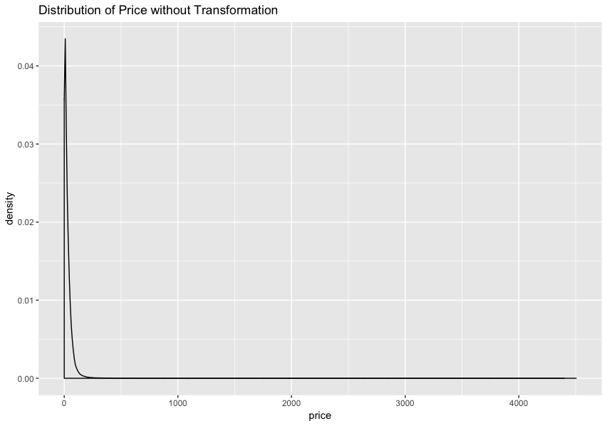
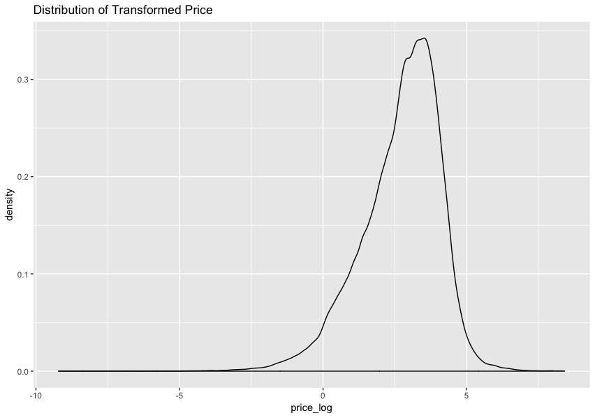

```{r global_options, include=FALSE}
knitr::opts_chunk$set(fig.pos = 'H')
```

# Abstract

This project explores what the relationship between company fundamentals and stocks prices indicates about recessions. To start, we replicated the results from the paper, "Stock Market Market Crash of 2008: an empirical study of the deviation of share prices from company fundamentals" by Taisei Kaizoji and Michiko Miyano [@kaizoji] using data from the years 2003 to 2013. Then, we expanded the paper's results through 2019, rebuilding and reassessing the models presented. We used the fundamental indicators of `cash and short-term investments`, `dividends per share`, and `carrying value` over time to fit an assortment of linear models, with the goal of choosing the best model to predict stock prices. Our tests indicated a linear fixed effects model with individual intercepts for each company to best describe this data. Kaizoji and Miyano propose using the residuals from the fixed effects model to form a new metric called Divergence Rate that measures the difference between the value of a company's stock based on fundamentals and the market determined stock price. Kaizoji and Miyano claim that Divergence Rate can serve as a recession indicator by measuring when the stock market is overvalued. We validated the Divergence Rate metric as an overall indicator of trends in the stock market by comparing mean markets trends, sector trends, and individual stock trends observed by economists in other research to the Divergence Rate derived with this model. We conclude that Divergence Rate has value as a metric for economic trend tracking.  

# Introduction  

Almost 10 years after the last recession, our economy is expanding; in fact, if this lasts for a few more months we would be in the longest economic expansion that the U.S. experienced. [@WP_slowdown] Yet, there has been talks recently about our economy headed towards another recession. Federal Reserve Chair, Jerome H. Powell said that he did not expect a recession in 2019. [@WP_powell] However, the inversion of the yield curve in addition to other factors has had many questioning its implications. [@WP_slowdown] Interestingly, a February survey conducted by the National Association for Business Economics revealed that of 280 business economists, approximately 50% believe that the U.S. will have another recession by 2020, and when this timeline was extended to the end of 2021, the number jumped to 75%. Only 11% answered that the U.S can avoid a recession within the next two years. In addition, another survey of almost 800 top business leaders worldwide indicated that a global recession was their biggest concern for 2019. [@WP_survey]

It is important to be able to predict a recession because they are inevitable, and it has a large impact with increased unemployment, decreased customer spending and negative growth. [@investopedia_recession] From an investors' standpoint, it also effects how they position their investments as well. However, there is much uncertainty when it comes to predicting a recession. According to one source, the four major factors to consider when trying to predict an economic recession are: 1) yield curve, 2) stock market, 3) unemployment, 4) housing prices. [@4_indicators] Of these indicators, recently, the yield curve has gained much attention and has been referenced often as one reason why there may be a recession in the near future. However, in looking at the yield curve, there are certain aspects such as the degree of inversion and quickness to conclusion that may have effect; there are many that - while acknowledging the importance of monitoring the yield curve - are skeptical when it comes to using it as a recession indicator. For example, according to one source, looking at instances of the 3 month/10-year treasury inversion and the 2 or 3-year bonds vs. 5 year gave some insight into the yield curve's predictive power. In the past 60+ years, there were 9 instances of 3-month/10-year treasury inversions. Of these, 2 were false positives; 7 were true with 5 that did not last more than 12 months. However, looking at the 2 or 3-year bonds and 5-year, there were 73 instances of inversion; yet, there were only 9 recessions. This result seems to not give as much insight into upcoming recessions. [@b_yield_curve]

Therefore, we focused on another major indicator, the stock market. Over the years the stock market has shown good indication of an upcoming recession, as the market often declines pre-recession. However, it also has its disadvantages such as the tendency to overreact and the possibility of it being a "false alarm," falling regardless of whether a recession is coming or not. [@4_indicators] In predicting a recession, there are multiple indicators that should be taken into consideration, and in this paper we take a deeper look into seeing if the stock market can help us gain better insight into upcoming recessions.

# Data

Our data is sourced from Factset. [@data] The quarterly fundamental indicators (i.e. `cash and short-term investments`, `dividends per share`, and `carrying values`) and `share price` from U.S companies between 2003 to 2019 were used. Time was treated as a discrete variable where four quarters were collapsed into yearly data. `Share price` represented the stocks' closing prices of the final day in the quarter. It is important to note that 2019 contains data for only the first quarter, which may lead to exaggerated trends for 2019. Additionally, we added a new binary variable to our data set based on `dividends per share` which was a decision we made during our initial data exploration. We noticed that many companies' quarterly data had dividends of 0. Therefore, `dividends = 0` simply indicated whether that instance of company fundamentals data had a dividend of 0 or not. This is not a variable in the paper [@kaizoji], and is specific to our project. Each row consisted of one company's quarterly data during the year. Only complete cases were included in the model, resulting in a total of 161,544 observations. Our final data set included 5,727 companies from 11 sectors (i.e. industrials, financials, IT, Utilities, Consumer Discretionary, Health Care, Energy, Materials, Real Estate, Consumer Staples and Telecommunications). Of the companies included in our dataset, 184 were missing sector information.

The fundamental indicators used in our analysis give information about company profitability and value. `Cash and short-term investments` show the value of a company's liquid assets. Liquid assets relate to a company's solvency and ability to expand, making this variable important to consider when valuing a company. `Dividends per share` notes the amount in dividends that a firm pays out to shareholders each quarter. [@dividend] The `carrying value`, which is also known as the book value, shows the stock's market value and how much shareholders would receive in the event that the company was liquidated. Carrying value is calculated by subtracting a company's total liabilities from total its assets. Carrying value gives investors a sense of whether a stock is being overvalued or undervalued. [@bookvalue] Taken together, these variables give information about the true value of a company that can be compared to the company's current stock price [@kaizoji].

# Models and Methodology
Our study focuses on the exploration of a number of linear regression models to predict stock price from company fundamentals. We started with the base model:

$$ln(price_{it}) = \beta_0 + \beta_1ln(dividends_{it}) + \beta_2\mathbb{I}(dividends = 0) + \beta_3ln(bookvalue_{it}) + \beta_4ln(cashflow_{it}) + \mu_{i} + \gamma_t + \epsilon_{it}$$
In this model, $\mu_i$ indicates the company effects and $\tau_t$ indicates the discrete time effects. We fit the models described in Table 1, and assessed each model for fit. We repeated this process twice. First, to validate the results presented by Kaizoji and Miyano using the years 2003-2013. Then, we re-fit all the models using 2003-2019.  

\begin{table}[!h]
\caption{$\mu$ and $\tau$ for All Tested Models}
\centering
\begin{tabular}{|l|l|l|}
\hline
 Model &  $\mu$ &  $\tau$ \\\hline
 Pooled \hspace{1mm} OLS &  0 & 0 \\
 Individual \hspace{1mm} Fixed \hspace{1mm} Effects & Fixed \hspace{1mm} Effect & 0 \\
 Time \hspace{1mm} Effects & 0 & Fixed \hspace{1mm} Effect  \\
 Two-Way \hspace{1mm} Fixed & 0 & Fixed \hspace{1mm} Effect \\
 Individual \hspace{1mm} Random & Random & 0 \\
 Time \hspace{1mm} Random & 0 & Random \\
 Two-Way \hspace{1mm} Random & Random & Random \\\hline
\end{tabular}
\end{table}  

We used F-tests to assess the pooled ols and fixed effects model performance, likelihood ratio tests to compare the pooled ols and fixed effects models, and Hausman Tests to compare the fixed and random effects models. In all cases, we obtained p-values indicating that the fixed effects models outperformed the pooled ols model and the random effects model. The best model overall was the fixed effect model with time and company intercepts included. These results replicate the results obtained by Kaizoji and Miyano, both for the years of data presented in their original paper and with the dataset expanded through 2019.

# Divergence Rate  

## Definition  

The overarching research question of the Kaizoji and Miyano paper we replicate here focused not on building the best model given the data (although this step is important), but on using a model that accurately describes company value to notice anomalies in the stock market at given time points. For this reason, the authors of the paper chose to use the fixed effects model with only company effects. Because we can assume that, in a perfect market, company fundamentals will always compose the stock price in an additive way with no time effects, the design choice to exclude time effects from the model makes contextual sense. Then, we can use the predictions from the model with compnay fixed effects to notice when stocks are overvalued or undervalued in the market. Kaizoji and Miyano propose a metric for this purpose named Divergence Rate defined as follows:

$$D_{it} = ln(Y_{it}) - ln(\tilde{Y}_{it})$$  

In this formula, $Y_{it}$ is the observed stock price for company $i$ at time $t$ and $\tilde{Y}_{it}$ is the model's prediction for the stock price of company $i$ at time $t$. The Divergence Rate indicates how overvalued or undervalued a company's stock is given that company's fundamental value at time $t$.   

## Mean Divergence Rate Over Time

Figures 1 and 2 below display the time effects coefficients from the two-way fixed effect model and the mean Divergence Rate by year. We can see that, as expected, these two figures track each other. While it feels counterintuitive to leave an informative variable out of the model, in this case, doing so gives us a powerful tool. Now, we can track in real time, how overvalued or undervalued the market is as a whole. Our sample only contains one recession (2008-2009), so it is less powerful than a dataset that contains all known recessions. However, we can look here to seek potential recession-indicating trends. In the years leading up to the recession, the market became overvalued. Then, in 2008, the recession led to an undervaluing of the market as a whole. Looking to the current year, we can see that in 2019, the market appears more overvalued than at any other point in the data set. Other recession indicators outside of our model have also recently appeared, including the inversion of the bond yield curve which has preceded every recent recession. [@yield] We interpret the overvaluing of 2019 indicated by our model cautiously, since we only have one quarter of 2019 in the data so far. But, this trend matches our assertion about the overvaluing of the market serving as a potential recession indicator. 

```{r, out.width = "480px", out.height = "288px", echo=FALSE, fig.cap="\\label{fig:figs} Time Fixed Effects Coefficients", warning=FALSE, message=FALSE}
library(knitr)
knitr::include_graphics("time_fixed_effects_coefficients.jpg")
```

```{r, out.width = "480px", out.height = "288px", echo=FALSE, fig.cap="\\label{fig:figs} Mean Divergence Rate by Year"}
knitr::include_graphics("mean_divergence_rate_by_year.jpg")
```

## Divergence Rate by Sector   

### All Sectors  

Viewing the mean Divergence Rate by sector reinforces the Divergence Rate as a metric to describe market behavior (see Figure 3). Take the energy sector as an example. Leading up to the 2008 recession, the Iraq War caused a global oil shortage. [@luft_luft] In response, oil prices rose significantly. Figure 3 shows the market response to the increase in oil prices over the years of 2005 to 2008 in the energy sector as a high mean Divergence Rate. During the recession in 2008, the energy sector remained overvalued when all other sectors became undervalued. However, as the Iraq region began to recover in the following years [@jaffe_jareer_elass], the valuation of the energy sector decreased as the oil market normalized. Seeing real world events reflected in the Divergence Rate adds confidence to this methodology.

```{r, out.width = "480px", out.height = "288px", echo=FALSE, fig.cap="\\label{fig:figs} Divergence of All Sectors"}
knitr::include_graphics("all_sectors_divergence.jpg")
```

### Real Estate   

We would also like to briefly highlight the Divergence Rate trends in the real estate sector, given the importance of real estate products and housing prices to the Great Recession. [@ellen_dastrup] In the early 2000's, mortgage lenders began extending credit to higher risk borrowers and apportioning this risk out to investors through private-label mortgage backed securities. [@duca] Adding more buyers to the market caused a spike in housing prices, leading to the overvaluing of the real estate market shown in Figure 4 during the years 2005, 2006, and 2007. Then, as high-risk lenders began to default on their loans en masse, the real estate market collapsed, leading to losses as the market became saturated with properties. Figure 4 shows this in the years from 2007 to 2012. Now, new regulations including the Dodd-Frank act have stabilized the market [@housing], shown in the years from 2013 onward. This anecedote offers further evidence that the Divergence Rate metric accurately tracks market trends. 

```{r, out.width = "480px", out.height = "288px", echo=FALSE, fig.cap="\\label{fig:figs} Divergence of Real Estate Sector"}
knitr::include_graphics("real_estate_divergence.jpg")
```

### FAANG Stocks  

To fully assess the performance of the Diversion Rate metric, we also looked into the behavior of the so-called FAANG stocks, composed of Facebook, Apple, Amazon, Netflix, and Google shown in Figure 5. Collectively, these stocks make up about 37% of the NASDAQ composite index, about 12% of the S&P 500, and about 5% of the Dow Jones index (calculated April 29, 2019). These stocks provide an alternate look at how well Diversion Rate tracks market trends because, during the entire first recession, these stocks had very different performance rates than the majority of the market. Unlike other stocks, the FAANG collection entered the recession undervalued and, until recently, displayed meteoric year-over-year growth. Now, the majority of these stocks are considered over-valued by our model. Recent headlines such as "A Toothless FAANG" in Forbes and "It's Time to Break up the FAANGs" in Markets Insider hint that the investment community has begun to feel wary of this group of stocks. The fact that our Divergence Rate metric reflects the patterns the investment community has noted in these stocks provides more evidence that Divergence Rate serves as a valid metric for assessing patterns in the stock market.

```{r, out.width = "480px", out.height = "288px", echo=FALSE, fig.cap="\\label{fig:figs} Divergence of FAANG Stocks"}
knitr::include_graphics("faang_stocks_divergence_dist.jpg")
```

# Limitations & Future Work  

When considering applications of this work, several expansions to the dataset may offer better generalizability. 

Our model only contains data from U.S. companies, since comparisons across currencies would have made the work of building this model more difficult. Normalizing across global currencies and including companies from markets outside the United States would likely improve the Divergence Rate metric when the purpose of analysis is to predict recessions. Kaizoji and Miyano built the original version of this model with global data, so the research with a dataset that includes multiple curriences and economies has already been started. However, it may be worth exploring if a large model that includes currency normalized data is more informative than a set of models for different regions or economy types. 

Due to computational limitations, we did not include the entire history of the United States stock market. However, since the sample size of recessions is so small, including as many recessions as possible in the model is important before drawing overarching conclusions about the validity of Divergence Rate calculated from our regression model as a recession indicator. From this work, we can only conclude that a high Divergence Rate may be related to an oncoming recession. Adding more recession samples might allow us to say that a high Divergence Rate is a likely recession indicator. 

If the user of this model had the goal of making money buying undervalued stocks (versus our goal of noticing larger market trends), a dataset with smaller time granularity (e.g. daily or monthly) may give better performance. With smaller time increments, the `dividends per share` indicator may prove less informative, since dividends are typically paid quarterly. However, we think Divergence Rate is likely a good metric overall for finding undervalued stocks and consider this area worthy of future work. 

# Conclusion

Despite the differences in the data we fit our models on, we saw similar trends as shown in the paper [@kaizoji]. Interestingly, the chosen models were the same and showed that despite there being a greater number of years and a data set consisting of different companies, the methods were useful for the project goals and purposes. Looking at specific sectors and companies illustrated an interesting picture of differences between groups as well, reflecting current global trends and observations. Based on this research, while domain knowledge is crucial for any decisions made using our methods, the model is a good indicator for understanding our economy and where it can be headed.

# Appendix.

## Variable Distribution 

During our in-class presentation, we received feedback from instructors about normalizing our response variable to ensure that the same variance condition is met before modelling. Figure 6 shows the distribution of price without any transformation (i.e. as the prices are) while Figure 7 shows the log transformed prices. Comparing the two, it is evident that the prices without transformation has a very long tail. However, in the transformed prices' distribution there is much more of an even distribution.

```{r, out.width = "480px", out.height = "288px", echo=FALSE, fig.cap="\\label{fig:figs} Distribution of Price without Transformation"}

```

```{r, out.width = "480px", out.height = "288px", echo=FALSE, fig.cap="\\label{fig:figs} Distribution of Price with Transformation"}

```

## Github Repository

This project has an extensive codebase, which may be accessed on github. (https://github.com/elegant-chaos/recession_indicators) Please note: the database we sourced our data from has usage restrictions, so the repository does not include our dataset. 

# Sources 
